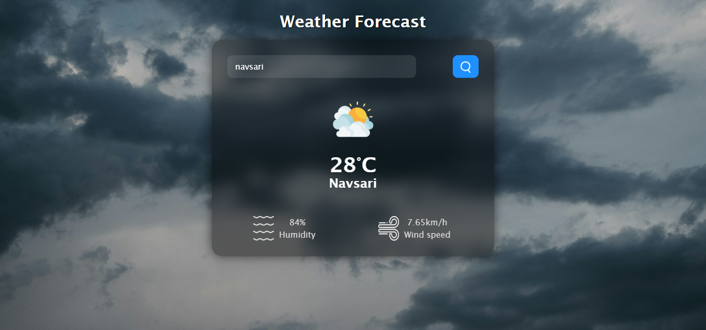
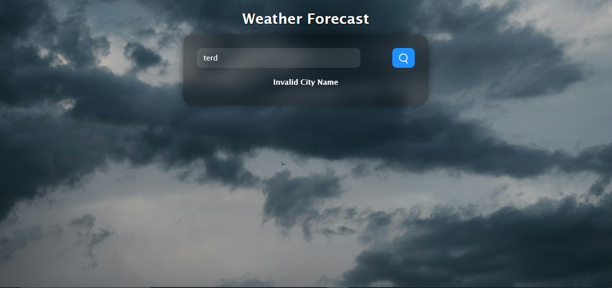

Link Here:- https://pr-weather-api-js.vercel.app/

Output:-

1. City Weather



2. Invalid City Name



# Weather API

A simple web application that allows users to search for current weather information by city name. The app fetches real-time weather data from the OpenWeatherMap API and displays temperature, humidity, wind speed, and weather conditions with relevant icons.

## Features

- Search for weather by entering a city name
- Displays current temperature, humidity, and wind speed
- Shows weather condition icons (clouds, rain, clear, drizzle, mist, snow)
- Responsive and user-friendly interface
- Handles errors for invalid or unknown city names

## Technologies Used

- HTML
- CSS
- JavaScript
- Vercel for deployment

## Folder Structure

```
PR_Weather_Api_JS/
│
├── Assets/
│   └── images/
│       ├── clouds.png
│       ├── clear.png
│       ├── rain.png
│       ├── drizzle.png
│       ├── mist.png
│       └── snow.png
│
├── script/
│   └── script.js
│
├── index.html
└── readme.md